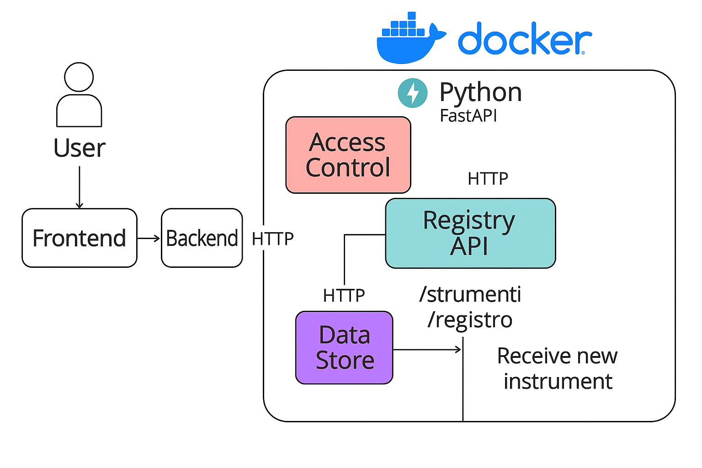

# Registry I-PHOQS - Microservizi con PostgreSQL

> **Progetto dimostrativo** per simulare un'architettura a microservizi in ambito R&I, basato su Docker, FastAPI e PostgreSQL.  
> Versione: *Speciale Poli Edition* – include data store persistente e accesso da frontend React.

---

## 🔧 Stack Tecnologico

- **Python** + **FastAPI** (per tutte le API)
- **Docker Compose** (per orchestrazione)
- **PostgreSQL** (con persistenza dati)
- **SQLAlchemy** (per mapping ORM)
- **pgAdmin** (GUI opzionale)
- **React** *(opzionale, come interfaccia utente)*

---

## 🧱 Microservizi attivi (4 + frontend)

1. **registry-api**  
   - Gateway REST principale  
   - Espone endpoint `/strumenti` e `/registro`  
   - Smista le richieste verso data-store

2. **access-control**  
   - Placeholder per logica auth  
   - Espone API per autenticazione e verifica permessi

3. **data-store**  
   - Connette al database  
   - Contiene ORM e logica SQLAlchemy  
   - Riceve richieste da registry-api

4. **db-postgres**  
   - Database containerizzato (nome: `registrydb`)  
   - Configurazione persistente

5. **pgAdmin** *(opzionale)*  
   - GUI visuale per interrogare e ispezionare il database  
   - Accesso via: [http://localhost:5050](http://localhost:5050)  
     - Email: `admin@i-phoqs.it`  
     - Password: `admin123`

---

## 🗂️ Struttura directory
Registry/ ├── registry-api/ │ ├── main.py │ ├── models.py │ └── Dockerfile ├── data-store/ │ └── app/ │ ├── main.py │ ├── models.py │ └── ... │ └── Dockerfile ├── access-control/ │ ├── main.py │ └── Dockerfile ├── frontend/ (opzionale, React) ├── docker-compose.yml └── README.md

---

## ▶️ Avvio del progetto

```bash
docker-compose up --build

## 🧪 Test rapidi
# Visualizza strumenti inseriti
curl http://localhost:8000/strumenti

# Inserisce nuovo strumento
curl -X POST http://localhost:8000/registro \
  -H "Content-Type: application/json" \
  -d '{"nome": "Laser Quantico", "laboratorio": "CNR Napoli"}'

  ## 🔭 Roadmap
 Estendere i modelli (TRL, categoria, note…)

 Integrare autenticazione reale con token

 Aggiungere frontend React stabile

 Esportazione in CSV/Excel

 Deployment pubblico (fase successiva)

  ## 🎯 Obiettivo
Far toccare con mano una piattaforma microservizi, con storage reale e interfaccia REST funzionante, per uso demo in team tecnici e progettuali.
